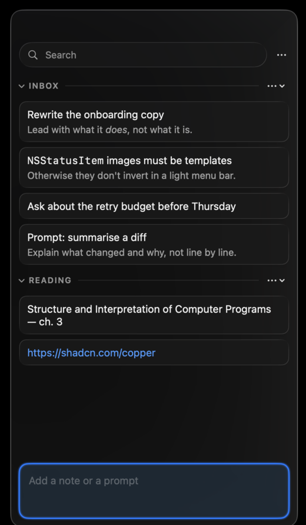
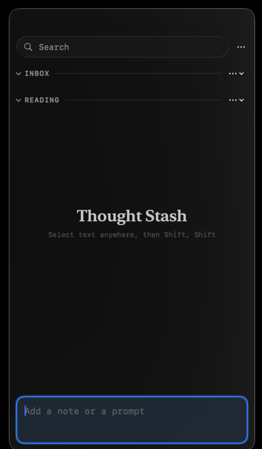

<p align="center">
  
</p>

<h1 align="center">Thought Stash</h1>

<p align="center">
  A local-only, native macOS scratchpad for AI-assisted work.<br>
  Select text in any app, double-tap Shift, and it's saved.
</p>

<p align="center">
  
  &nbsp;&nbsp;
  
</p>

Inspired by [Copper by shadcn](https://shadcn.com/copper), which does the same job with the
same double-Shift gesture. This is an independent native implementation, not a fork or a port.

## Requirements

macOS 26 or later. The UI is built on Apple's Liquid Glass material and there is no fallback
path for older systems.

## Install

```sh
./Scripts/build-app.sh
cp -R "dist/Thought Stash.app" /Applications/
open "/Applications/Thought Stash.app"
```

For development, `swift run ThoughtStash`. Tests are `swift test`.

On first capture macOS asks for Accessibility access. Enable **Thought Stash** in
System Settings → Privacy & Security → Accessibility, then try the shortcut again.
Permissions attach to the app's code identity, so test global capture from an installed,
signed build rather than from `swift run`.

## Shortcuts

| Action | Key |
| --- | --- |
| Capture selection / show and focus composer | Shift, Shift |
| New quick note | ⌘N |
| Search | ⌘F |
| Select previous / next note | ⌘↑ / ⌘↓ |
| Copy selected notes | ⌥⌘C |
| Edit selected note | ⌘E |
| Merge selected notes | ⇧⌘M |
| Delete selected notes | ⌘⌫ |
| Show every shortcut | ⌘/ |

Every command also appears in the **Notes** menu. The menu, the in-app guide, and the ambient
hints all read from one `ShortcutMap`, so they cannot drift apart.

## What it does

- Global selected-text capture on a configurable double-modifier shortcut, preserving rich
  text formatting through save, reload, merge, and copy
- Floating panel plus a menu bar item, both reachable when Secure Input blocks the global tap
- Sections, search, Markdown rendering, inline editing, completion, and deletion
- Multi-select with merge, move, copy, and numbered-list copy
- Three typefaces for the whole app: SF Pro, New York, SF Mono

Every note is one Markdown document. Its first meaningful line becomes the card title; the rest
is the preview. There is no separate title field.

## Storage

Notes live in readable JSON at `~/Library/Application Support/Thought Stash/notes.json`.
No account, no sync, no analytics, no network calls.

## Repo layout

| Path | |
| --- | --- |
| `Sources/ThoughtStash/` | The app |
| `Icon/AppIcon.svg` | Icon artwork, the source of truth |
| `Scripts/make-icon.sh` | Renders the icon to `Resources/AppIcon.icns` (needs `librsvg`) |
| `Scripts/build-app.sh` | Builds and signs the `.app` bundle |
| `design.md` | Design principles, visual direction, and the iteration checklist |

Re-run `Scripts/make-icon.sh` after editing the SVG. The `.icns` is checked in so an ordinary
build needs no extra tooling.
